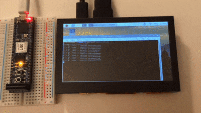
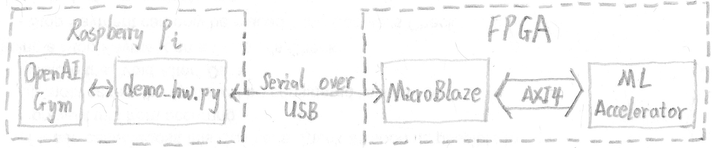
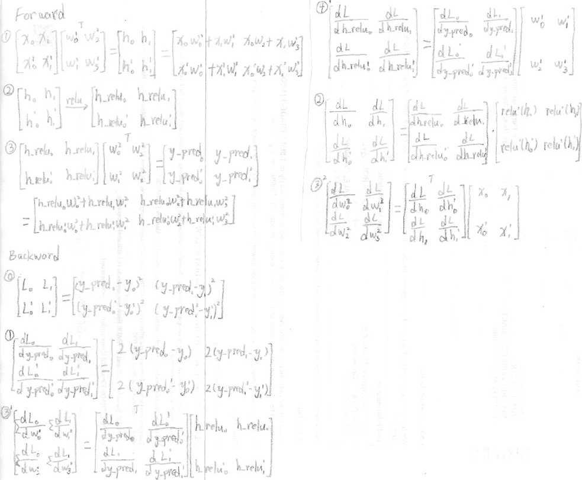
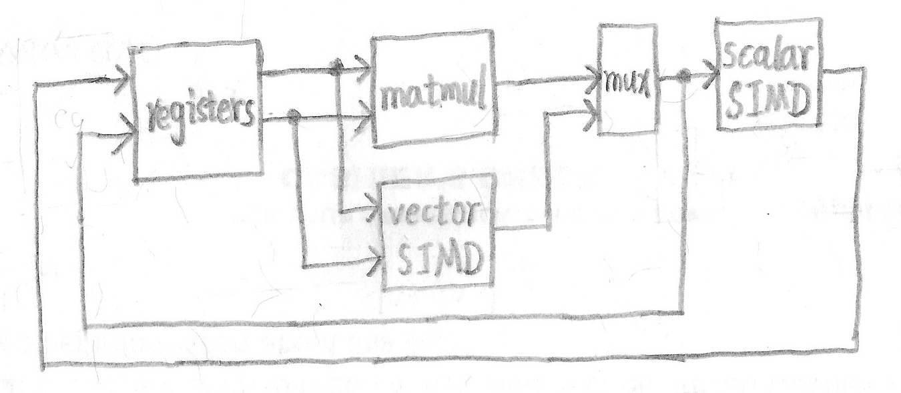

# The Stupidly Simple ML Accelerator

This is going to be the most simple and stupid design of a machine learning accelerator on earth.
The fact that it can do reinforcement learning in real time was quite a surprise.
It has a systolic array of 16 fused multiply–accumulate (FMAC) units that can perform 4x4 matrix multiplication in just 4 clock cycles.
But the author refused to give it a proper instruction decoder, which is considered by him as a feature instead of a bug.
This impeded its popularity because there's exactly one person who knows how to program it, which is substantially fewer than PlayStation 3.

The project is ongoing until the author decides to stop struggling with it.

## Features

- VLIW architecture with 64-bit fixed format instructions
- Computes in FP16 that enables ML training
- 4x4 systolic array of FMAC units for matmul
- 4-channel vector and scalar SIMD units for activation
- 16 4x4 matrical registers that can also do transpose
- Estimated performance of 2 GFLOPS @ 100 MHz

## Demo

The demo is to show that a very simple design can do something significant, and to discourage anyone from thinking ML is more complicated than that.



(Note: this is a mockup. The real one should look exactly the same. See the master plan below)

What it does here is to run deep Q-learning to solve cartpole, which is a classic reinforcement learning problem.
The training and inference of the value network runs on the ML accelerator on a FPGA.
The UI is [OpenAI Gym](https://github.com/openai/gym), which runs on a Raspberry Pi.
The FPGA connects to the Raspberry Pi as a peripheral.
There's a MicroBlaze soft-processor on the FPGA to handle the communication between them.
The accelerator talks to MicroBlaze via the AXI4 bus.



Here is the math of feedforward and backpropagation of the 2-layer neural network in the demo.
And this is what really runs on the accelerator.



Files:

- [`demo/demo_hw.py`](demo/demo_hw.py): the real deal that runs training and inference on the hardware
- [`demo/demo_sim.py`](demo/demo_sim.py): simulation of the exact way calculations are done on the hardware
- [`demo/demo_golden.py`](demo/demo_golden.py): PyTorch version as the baseline for behavior and benchmark

## Architecture



The architect is designed to optimize for inference and also enable training.
The most prominent feature is the cascading of computational units.
In the forward pass, *matmul* does the calculation of a fully-connected layer and *scalar SIMD* does the activation.
So the computation of a single layer is done in one round.
And the results from both units are captured, which enables gradients calculation later on.
In the backward pass, all 3 computational units can be mixed-and-matched to complete the all the necessary math of backpropagation with reasonable performance.

The choice to do VLIW was to eliminate the instruction decoder and the controller.
Doing so exposes all the internal controlling signals directly as the instruction.
This greatly simplifies the design and provides the ultimate flexibility.
But programming it requires a new way of thinking, which is good for creativity.

Currently the design is on a toy level. Some obvious limitations are:
1. All calculations are based on 4x4 matrices. You can do larger calculations even convolutions with some clever tricks, which was supported and intended by the design.
1. Only ReLU is supported as the activation function. I don't see the need for anything else. And it's easily extensible if it's ever the case.
1. No cache, no storage hierarchy, no pipelining. Those impacts the performance, not the functionality, which is the focus right now.

Though intended as a ML accelerator, it can serve other SIMD applications such as image processing and other scientific computations built around matmul.

Files:

- [`matmul.v`](matmul.v): matrix multiplication unit that has 4x4 systolic array of FMAC 
- [`simd.v`](simd.v): one-input and two-input SIMD ALUs
- [`regfile.v`](regfile.v): 4x4 matrical registers that can also do transpose
- [`top.v`](top.v): defines the instruction format and the connections between components

## Instruction Format

```
op_mm | op_sv | op_ss | op_t | rd1 | rd2 | rs1 | rs2 | rsvd | rd3 | rs3 | const
  2   |   2   |   2   |  2   |  4  |  4  |  4  |  4  |  16  |  4  |  4  |  16
```

- **op_mm**: action for the matmul unit
  - 0 - nop
  - 1 - clear the accumulator
  - 2 - do the matmul calculation
  - 3 - *invalid*
- **op_sv**: action for the vector SIMD unit
  - 0 - nop
  - 1 - add
  - 2 - sub
  - 3 - element-wise mul
- **op_ss**: action for the scalar SIMD unit
  - 0 - nop
  - 1 - threshold
  - 2 - compare
  - 3 - scalar mul
- **op_t**: enable transpose of *rs1* and *rs2*
- **rd1**: select the register for the result from matmul or vector SIMD
- **rd2**: select the register for the result from scalar SIMD
- **rs1**, **rs2**: select registers for the 2 operands
- **rsvd**: reserved
- **rd3**: select the register to output to the external bus
- **rs3**: select the register to input from the external bus
- **const**: single-precision immediate number as an input to scalar SIMD

There is not a list of instructions as you would normally expect.
You program it by reverse-engineering it.
More specifically, you look at the architectural diagram and think of the action of each component to accomplish a computation, and compose the instruction to represent it.
The hardware is only the execution unit.
All the scheduling and parallelism are handled by the programmer or the compiler, which is the philosophy of VLIW and RISC.

## The Master Plan

The whole thing isn't working right now as the author hasn't finished struggling with it.

- ~~Architectural design~~
  1. ~~Matmul with the systolic array~~
  1. ~~Components and connections~~
  1. ~~Instructions~~
- Implementation
  1. ~~Coding~~
  1. Testcase (WIP)
  1. Debug (WIP)
  1. Change all computations to floating-point
- Demo
  1. ~~Architecture~~
  1. ~~Math~~
  1. ~~Simulation~~
  1. AXI4 integration
  1. Driver code on MicroBlaze
  1. Python code on the host
  1. Debug
- Code quality improvement
  1. Cleanup
  1. Parameterize the design
